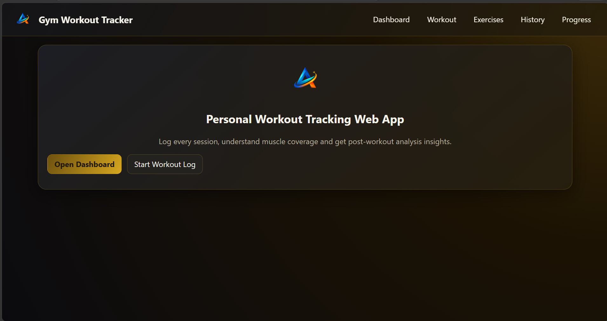
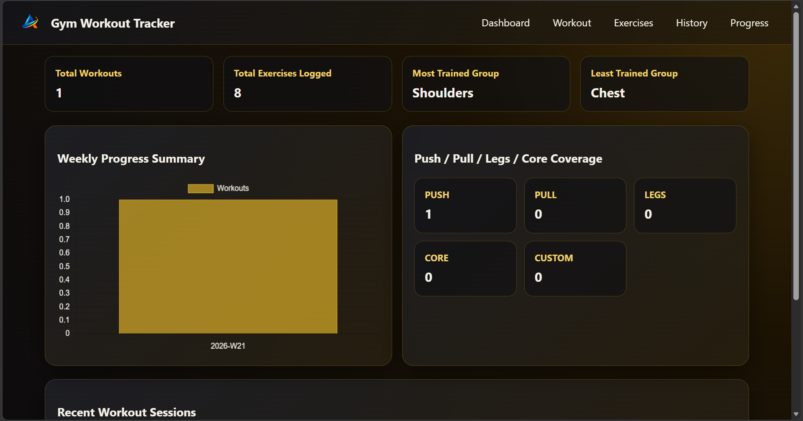
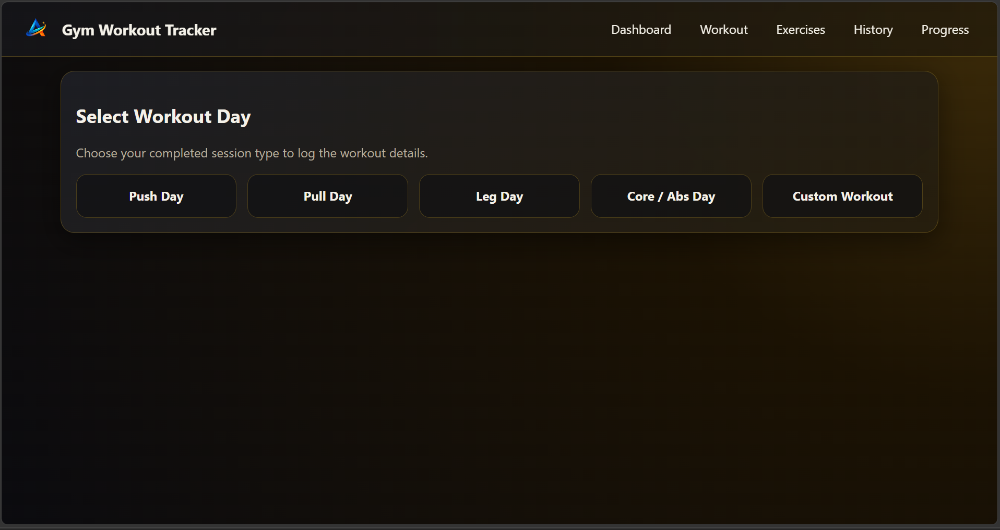
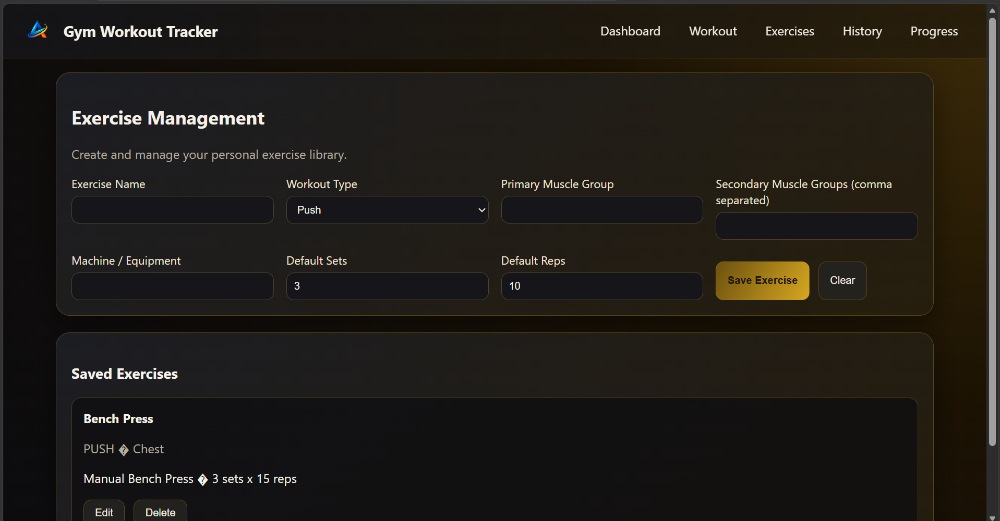
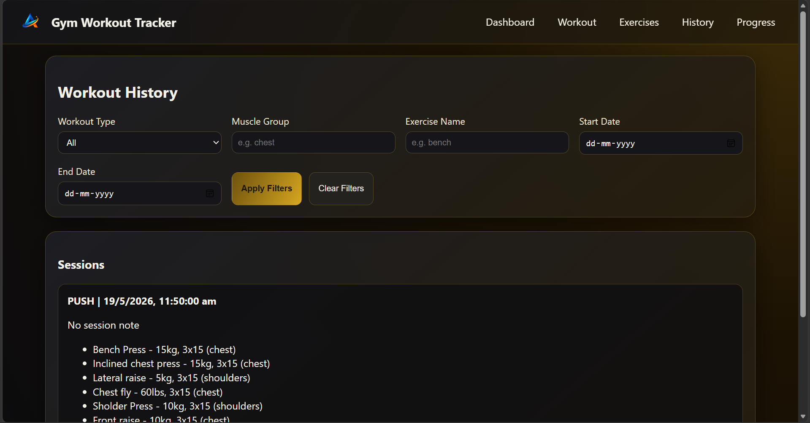
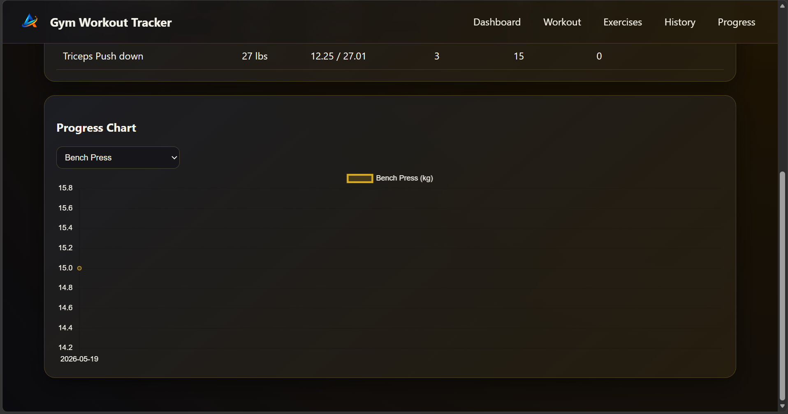

# Gym Workout Tracker
A personal workout tracking tool to log training sessions, manage exercises, review workout history, and monitor progress over time.

## Features
- Log completed workout sessions
- Choose workout type:
  - Push Day
  - Pull Day
  - Leg Day
  - Core / Abs Day
  - Custom Workout
- Create and manage a personal exercise library
- Store exercise details such as:
  - Workout type
  - Primary muscle group
  - Secondary muscle groups
  - Equipment or machine
  - Default sets and reps
- Dashboard with:
  - Total workouts
  - Total exercises logged
  - Most trained muscle group
  - Least trained muscle group
  - Weekly progress summary
  - Push / Pull / Legs / Core coverage
- View complete workout history
- Filter history by:
  - Workout type
  - Muscle group
  - Exercise name
  - Date range
- Track exercise progress using charts

## Tech Stack
- HTML  
- CSS  
- JavaScript  
- Python  
- Flask  
- JSON  

## How to Run
1. Open terminal in the project folder

2. Install Flask if needed:

```bash
pip install flask
```

3. Run the application:

```bash
python app.py
```

4. Open in browser:

```text
http://127.0.0.1:5000
```

## Screenshots
### Home Page


### Dashboard


### Workout Day Selection


### Exercise Management


### Workout History


### Progress Chart


## Note
- Please do not reuse the personal logo or branding assets without permission.
